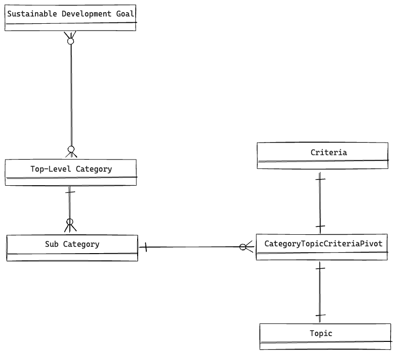

# Architecture

## Technologies used

The a11y-Score project imports a [Planet OSM file](https://planet.openstreetmap.org/) using [imposm3](https://imposm.org/docs/imposm3/latest/) into a [PostgreSQL](https://www.postgresql.org/) database with the [PostGIS extension](https://postgis.net/).

Configuration and code is written in [TypeScript](https://www.typescriptlang.org/), which runs primarily SQL queries against the PostgreSQL database (OSM Sync) to compute scores and persist them in a second PostgreSQL database (App). The backend itself is built on top of [nitro](https://nitro.build/). [drizzle](https://orm.drizzle.team/) is used as abstraction layer on top of the database and for managing the schema and running migrations on the results database. [Redis](https://redis.io/) will be used in the future as key value storage.

## Structure and data model

In order to evaluate the accessibility of the physical world as close to reality as possible, it is broken down by a hierarchical category tree. At the lowest level, the score of each category can be computed for a given region using a list of criteria, which is itself grouped into topics.

