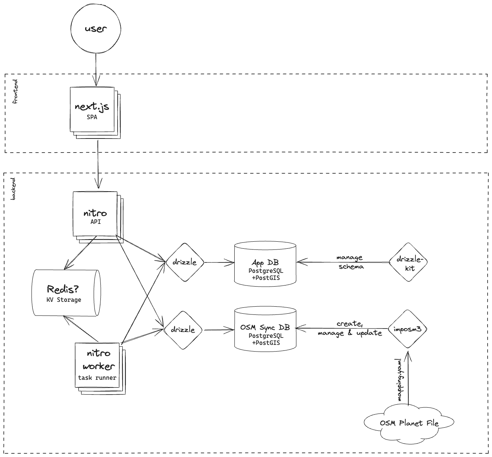
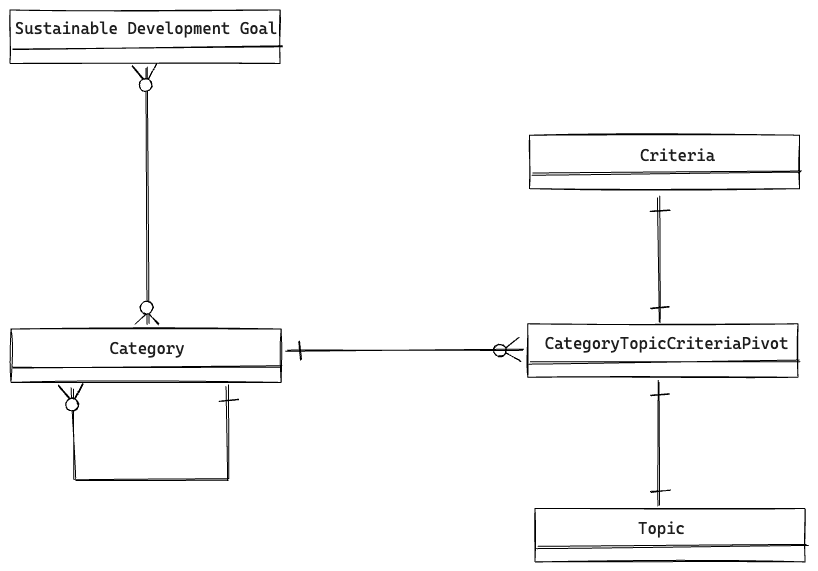
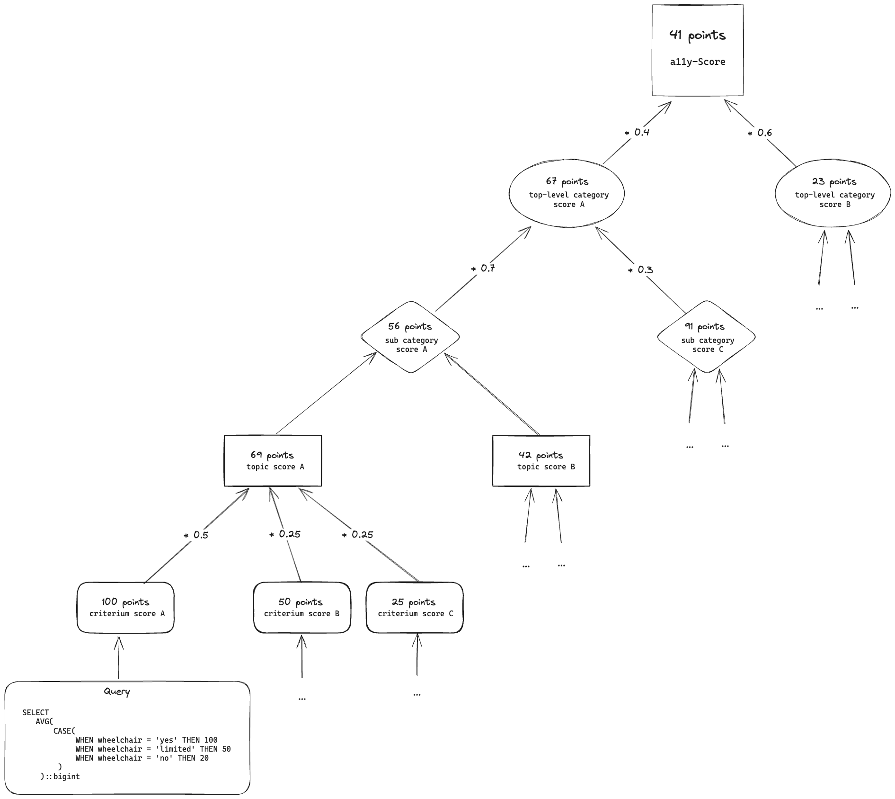
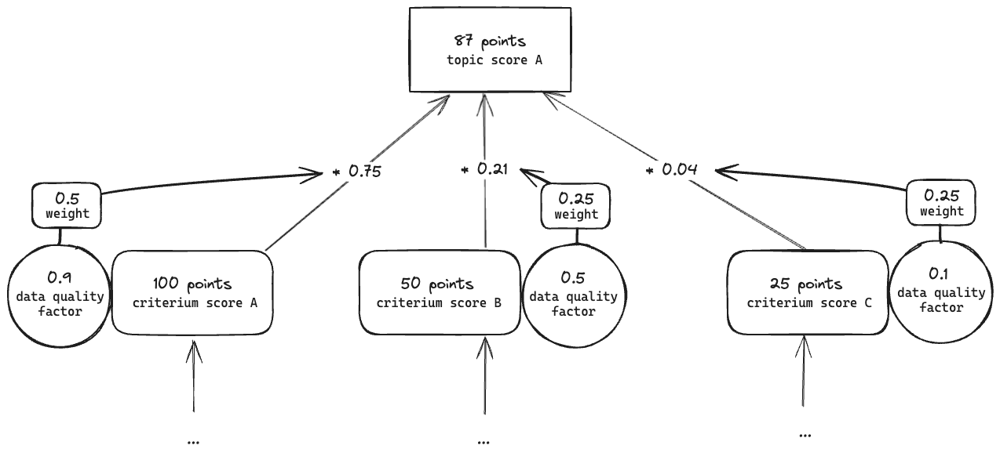

# Architecture

## Table of Contents

1. [Technologies used](#technologies-used)
2. [Structure and data model](#structure-and-data-model)
3. [Scoring algorithm](#scoring-algorithm)
4. [Data quality](#data-quality)

## Technologies used

The a11y-Score project imports a [Planet OSM file](https://planet.openstreetmap.org/) using [imposm3](https://imposm.org/docs/imposm3/latest/) into a [PostgreSQL](https://www.postgresql.org/) database with the [PostGIS extension](https://postgis.net/).

Configuration and code is written in [TypeScript](https://www.typescriptlang.org/), which runs primarily SQL queries against the PostgreSQL database (OSM Sync) to compute scores and persist them in a second PostgreSQL database (App). The backend itself is built on top of [nitro](https://nitro.build/). [drizzle](https://orm.drizzle.team/) is used as abstraction layer on top of the database and for managing the schema and running migrations on the results database. [Redis](https://redis.io/) will be used in the future as message queue and key value storage and very probably [BullMQ](https://docs.bullmq.io/) (or something similar) as a task runner and scheduler.

The [frontend](https://github.com/sozialhelden/a11yscore-frontend) is built with [React Router](https://reactrouter.com/) and uses Sozialheldens own [ui library](https://github.com/socialhelden/ui). For internationalization, we use [Transifex Native](https://transifex.com) across all of our projects.

## Structure and data model

In order to evaluate the accessibility of the physical world as close to reality as possible, it is broken down by two levels of categories. At the lowest level each sub category has a list of criteria, which is itself grouped into topics.

For example, we can break the whole transport system (top-level category) down to individual bus stops and train stations (sub categories), and evaluate the accessibility of each of these entities based on criteria that are relevant for that entity. E.g. for a train station we can look at the availability of tactile paving and the presence of announcements (criteria) and evaluate then the overall accessibility of the for vision impairment (topic) that groups them together. While tactile pavement is a great criterion for the vision topic, the mobility impairment topic would look at the presence of ramps and elevators instead.

## Scoring algorithm

For each criterion, an integer score is calculated. We define `100` points to be the equivalent that the accessibility criterion is fully met. The criteria scores inside a topic are weighted and summed up to form a topic score. The topic scores inside a sub category are averaged to form the sub category score. Finally, the sub category scores inside a top-level category are weighted and summed up to form the top-level category score. The overall score is then calculated as weighted sum of the top-level category scores.

## Data quality

Some OSM tags are more frequently used and more consistently applied than others. In addition, the completeness of the data varies greatly from region to region. These factors can lead to significant distortions of the calculated score. In order to mitigate that, we calculate a data quality factor for each score, where `1` is defined as perfect data quality and `0` as no data at all, it factors in the relative frequency of tags in a given area, but will be extended in the future to include more metrics. The data quality factor is then applied to all weights (via multiplication and normalization, so the weights add up to `1` again), effectively reducing the impact of scores with low data quality on the overall score.

