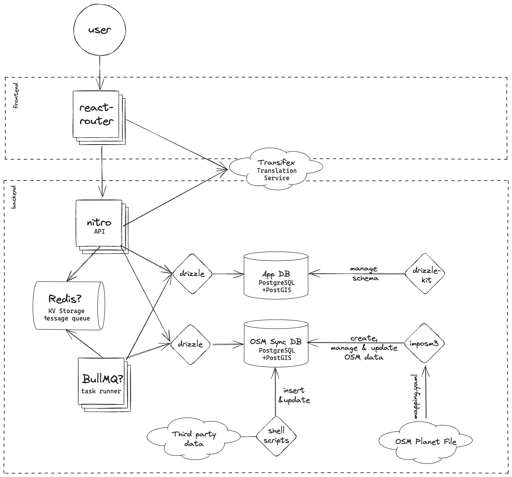

# Architecture

## Technologies used

The a11y-Score project imports a [Planet OSM file](https://planet.openstreetmap.org/) using [imposm3](https://imposm.org/docs/imposm3/latest/) into a [PostgreSQL](https://www.postgresql.org/) database with the [PostGIS extension](https://postgis.net/).

Configuration and code is written in [TypeScript](https://www.typescriptlang.org/), which runs primarily SQL queries against the PostgreSQL database (OSM Sync) to compute scores and persist them in a second PostgreSQL database (App). The backend itself is built on top of [nitro](https://nitro.build/). [drizzle](https://orm.drizzle.team/) is used as abstraction layer on top of the database and for managing the schema and running migrations on the results database. [Redis](https://redis.io/) is being used as message queue and key value storage, and we use [bullmq](https://docs.bullmq.io/) as a task runner and scheduler.

The [frontend](https://github.com/sozialhelden/a11yscore-frontend) is built with [React Router](https://reactrouter.com/) and uses Sozialheldens own [ui library](https://github.com/socialhelden/ui). For internationalization, we use [Transifex Native](https://transifex.com) across all of our projects.

## Structure and data model

In order to evaluate the accessibility of the physical world as close to reality as possible, it is broken down by two levels of categories. At the lowest level each sub category has a list of criteria, which is itself grouped into topics.

## Scoring algorithm

For each criterion, an integer score is calculated. We define 100 points to be the equivalent that the accessibility criterion is fully met. The criteria scores inside a topic are weighted and summed up to form a topic score. The topic scores inside a sub category are averaged to form the sub category score. Finally, the sub category scores inside a top-level category are weighted and summed up to form the top-level category score. The overall score is then calculated as weighted sum of the top-level category scores.

