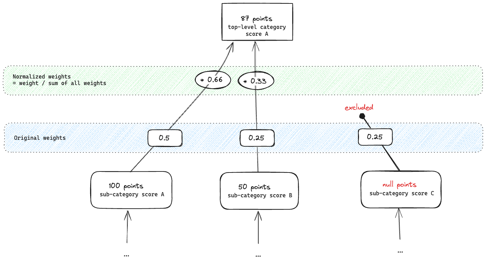
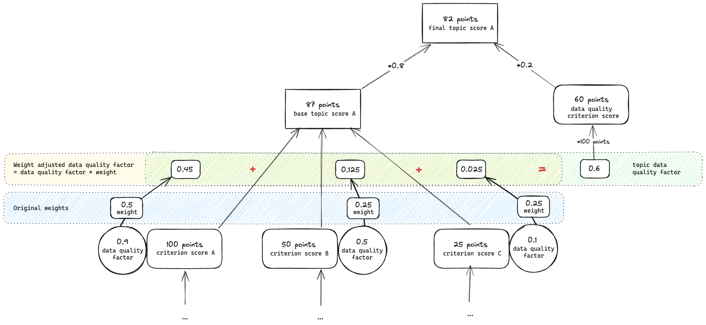

# Scoring algorithm

## Table of Contents

- [Structure and data model](#structure-and-data-model)
- [Scores](#scores)
- [Score exclusion and weight normalization](#score-exclusion-and-weight-normalization)
- [Data quality](#data-quality)
  - [Data quality adjusted weights](#data-quality-adjusted-weights)
  - [Data quality criterion score](#data-quality-criterion-score)

## Structure and data model

In order to evaluate the accessibility of the physical world as close to reality as possible, it is broken down by two levels of categories. At the lowest level each sub category has a list of criteria, which is itself grouped into topics.

For example, we can break the whole "transport system" (top-level category) down to individual "bus stops" and "train stations" (sub categories), and evaluate the accessibility of each of these entities based on criteria that are relevant for that entity. E.g. for a train station we can look at the "availability of tactile paving" and the "presence of announcements" (criteria) and evaluate then the overall accessibility for "vision impairment" (topic) that groups them together. While "tactile pavement" is a great criterion for the "vision" topic, the "mobility impairment" topic would look at the "presence of ramps and elevators" instead.

## Scores

For each criterion, an integer score is calculated. We define `100` points to be the equivalent that the accessibility criterion is fully met. We define `20` points to be the equivalent that the accessibility criterion is not met at all. A score of `0` points is defined as "absence of data", meaning that there is no data available to assess the criterion.

The criterion scores inside a topic are weighted and summed up to form a topic score. The topic scores inside a sub category are averaged to form the sub category score. Finally, the sub category scores inside a top-level category are weighted and summed up to form the top-level category score. The overall score is then calculated as weighted sum of the top-level category scores.

## Score exclusion and weight normalization

In some cases, especially in rural areas, there might be no places/geometry available within a sub-category. In that case, the sub-category score is excluded from the calculation of the top-level category score, and the weights of the remaining sub-categories are normalized to add up to `1`.

Note: This only happens for non-existing geometry! If criterion data is missing for existing geometry, it is handled differently, see the "Data quality" section below.

## Data quality

### Data quality adjusted weights

Some OSM tags are more frequently used and more consistently applied than others. In addition, the completeness of the data varies greatly from region to region. These factors can lead to significant distortions of the calculated score. In order to mitigate that, we calculate a data quality factor for each score, where `1` is defined as perfect data quality and `0.2` as no data at all. We chose `0.2` as floor so scores with a very low data quality still contribute to the overall score. It factors in the relative frequency of tags in a given area, but will be extended in the future to include more metrics. The data quality factor is then applied to all weights (via multiplication and normalization, so the weights add up to `1` again), effectively reducing the impact of scores with low data quality on the overall score.

### Data quality criterion score

In addition to adjusting weights, we also calculate a separate data quality criterion score for each topic which accounts for 20% of the overall topic score. This additional data quality score is calculated as the weighted sum of all criterion data quality factors multiplied by a `100` points. This effectively offsets negative impacts of adding new data with low accessibility, as we want to incentivize data collection even if the collected data highlights bad or worse accessibility.

