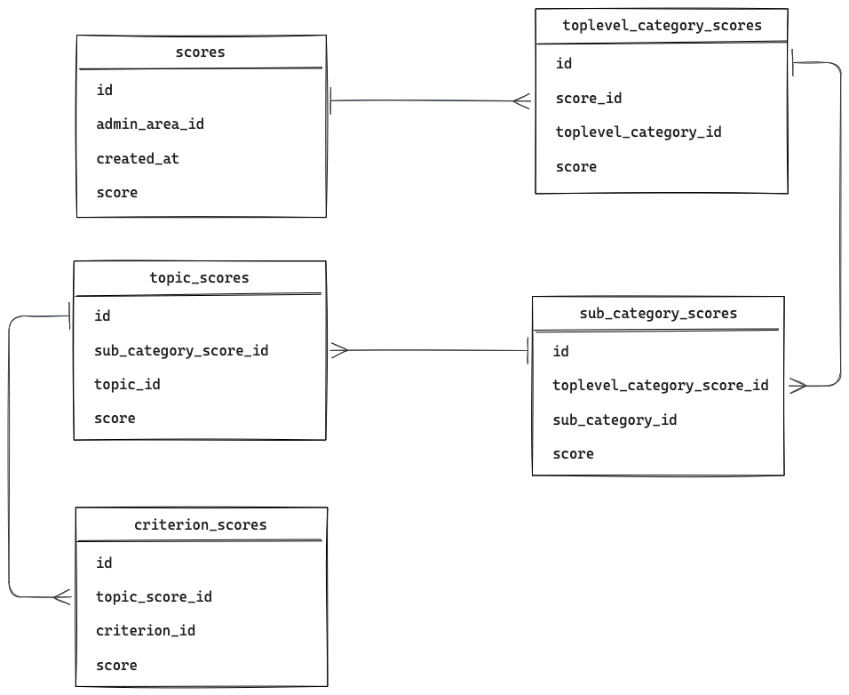

# ADR 5 - Database Setup and Score Computation

## Status
✅ Accepted on 2025-09-18

## Context
The computation of scores is quite complex and requires a lot of computational resources.

There are additional requirements to compare historical scores and track changes over time as well as the ability to give users actionable advice on how to improve scores for a given region.

Additionally, the PostgreSQL database used for storing raw Open Street Map (OSM) data is built and managed by imposm3. Even though imposm3 is keeping it up-to-date with OSM itself using changesets, speaking from experience, it is sometimes necessary to start a new OSM import from scratch, rebuilt and replace the entire database. This happens rarely, but the overall architecture should account for that.

In addition to data from OSM, the algorithm will incorporate additional data from other sources, like data of population density. So, the overall architecture of the system also needs to take into account that this third party data needs to be stored somewhere and can be used in the same SQL queries that query the OSM database.

Therefore, a robust strategy is needed to compute and store scores, as well as import, store and make third party data queryable efficiently.

## Decision

### Database setup
In addition to the PostgreSQL database used for storing OSM data we call `OSM sync database`, we decide to set up a separate PostgreSQL database dedicated to store results we call `app database`.

We decide to store third party data directly in the OSM sync database. We aim to create a manual process e.g. including node or shell scripts to create the necessary tables and import third party data into this database directly. Currently, the only third party data we plan to use is population density data. This type of data is updated very rarely, recording to our research, at most every couple of years. As we don't update this data frequently, we do not need to invest in a more complex or automated ETL process. We also looked into storing third part data either in the app database or in another separate database and use techniques like foreign data wrappers to make it queryable within the OSM sync database. This can be a valid approach for the future, especially if we decide to use more third party data sources that are updated more frequently. However, for now, we decided against this approach as it adds a lot of additional complexity and overhead to the system.

### Score computation
We decide to compute scores for a list of predefined admin-areas on a regular basis, starting at once a month. The computation happens asynchronously in separate worker processes. The results of the computation are then persisted in the app database.

As established in ADR 4, the computation of the overall scores is mostly done by computing (weighted) averages of intermediate category, topic and criteria scores. In order to allow for historical comparisons and to give users actionable advice on how to improve scores, we need to store not only the final score for a given admin-area but also the intermediate scores down to the individual criteria.

### Results data model
We decide to store the results in a standardized relational data model.

We also looked into storing all the intermediate scores in the same row. This either adds a lot of complexity by needing to sync the score configuration with the database schema to add additional columns. Or alternatively it would require JSON or hstore columns to store intermediate scores. Except for JSON column it won't represent the hierarchical nature of the data very well and move the complexity of it to the view layer. By doing it this way, it also supports statistical calculations across different scores and regions better in the future.

## Consequences
By having two database as the same time, we need to ensure that both databases are properly backed up and monitored. This adds some additional operational overhead to the system. But as we're internally leveraging a Kubernetes PostgreSQL operator, this overhead is minimal.

By using a manual process to store third party data directly in the OSM sync database, we need to ensure that this process is actually followed whenever the OSM sync database needs to be rebuilt from scratch. This adds additional work to be done, but as it happens so rarely, we believe this is an acceptable trade-off. There is also a certain risk that this step is forgotten. However, when this process is documented properly and included in the overall documentation of the system, this risk is very minimal.
