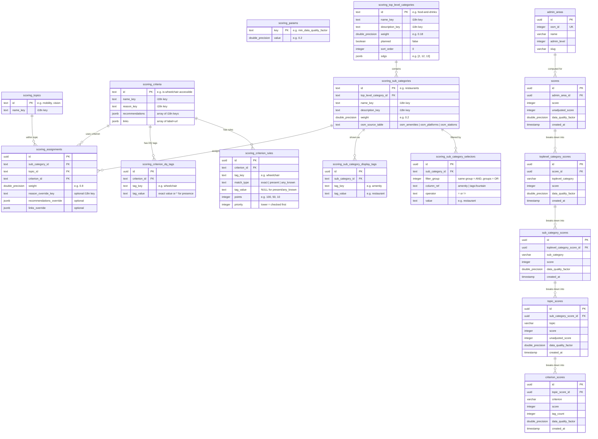
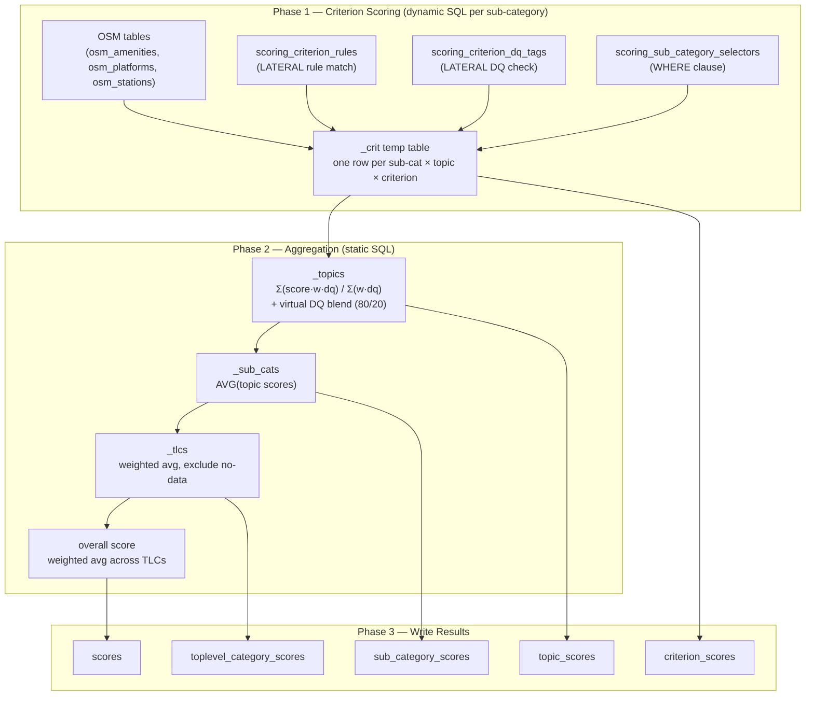

# Scoring Config — Entity Relationship Diagram

This diagram shows the proposed database schema for storing all scoring algorithm
configuration (weights, criterion rules, data-quality tags, sub-category selectors,
and the category→topic→criterion wiring) that is currently hardcoded in TypeScript.

The **existing result tables** (`scores`, `toplevel_category_scores`, etc.) are shown
in grey — they remain unchanged but are included for context.

## Table Summary

| Table | Purpose | Replaces |
|---|---|---|
| `scoring_params` | Global algorithm constants | `config/data-quality.ts`, 80/20 blend ratio |
| `scoring_topics` | Topic definitions | `config/topics/index.ts` |
| `scoring_criteria` | Criterion metadata (name, reason, links) | `config/criteria/*.ts` (metadata) |
| `scoring_criterion_rules` | Scoring CASE WHEN branches per criterion | `config/criteria/*.ts` (`sql` functions) |
| `scoring_criterion_dq_tags` | Tags for data quality factor calculation | `config/criteria/*.ts` (`osmTags` arrays) |
| `scoring_top_level_categories` | Top-level category definitions + weights | `config/categories/*.ts` (top-level) |
| `scoring_sub_categories` | Sub-category definitions + weights + source table | `config/categories/*.ts` (sub-categories) |
| `scoring_sub_category_selectors` | POI filter conditions per sub-category | `config/categories/*.ts` (`sql.where`) |
| `scoring_sub_category_display_tags` | OSM tags shown in the frontend | `config/categories/*.ts` (`osmTags`) |
| `scoring_assignments` | Wiring: sub-category × topic × criterion + weight | `config/categories/*.ts` (`topics[]` arrays) |

## Aggregation Hierarchy (data flow during `compute_scores()`)

